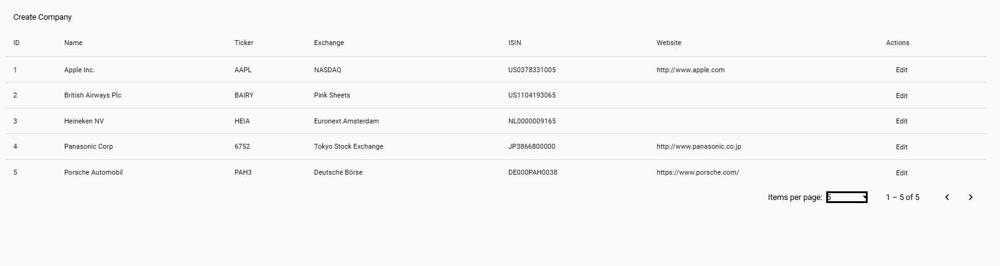

# Companies UI

A simple Angular  app for managing companies with a .NET CompanyAPI backend.

- paginated, editable grid of companies.
- auto-authenticates to the backend  before each request.
- Edit and create companies directly from the grid.

---

## Requirements

- Node.js 
- npm 
- .NET CompanyAPI backend running at https://localhost:44374/

---

## Getting Started

### 1. Clone or unzip this project

### 2. Install dependencies

npm install
### 3. Start the Angular app
ng serve 
### 4. Ensure the backend is running at https://localhost:44374/

## Future Improvements
- Add validation messages when creating or editing companies.
- Implement error handling for API requests.
- Add unit tests for components and services.
- Improve UI/UX with better styling and user feedback.
- Implement search functionality for companies.

